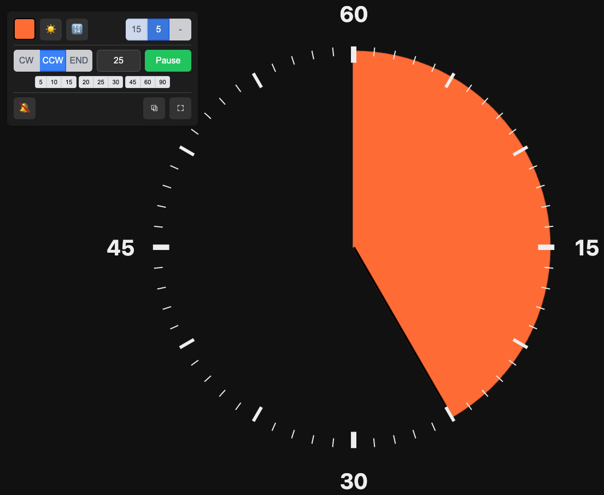
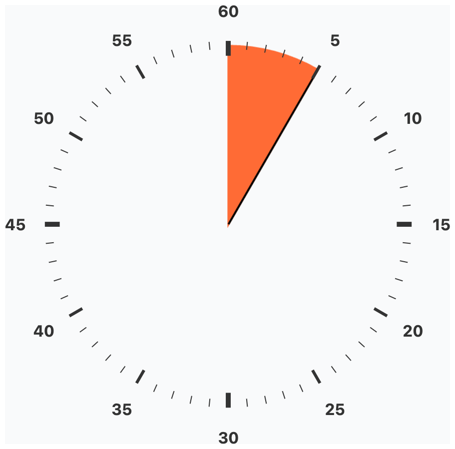
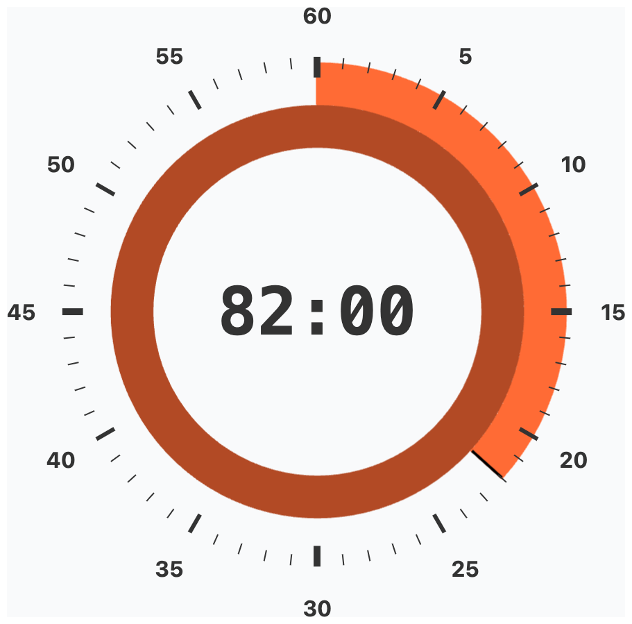
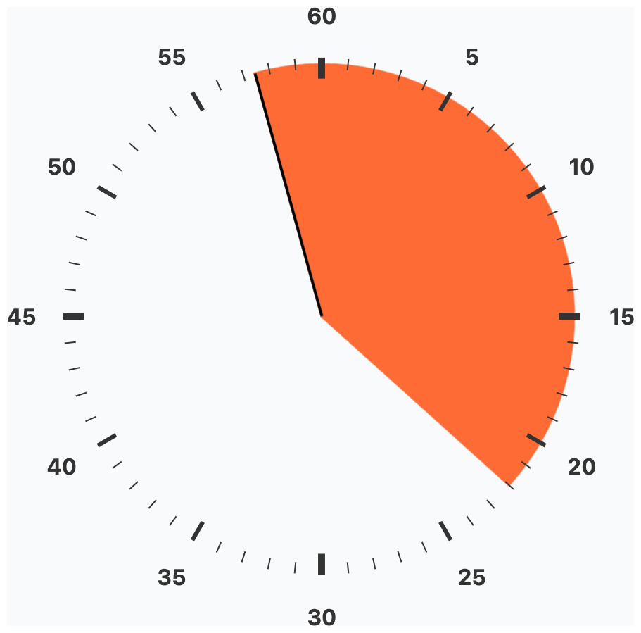
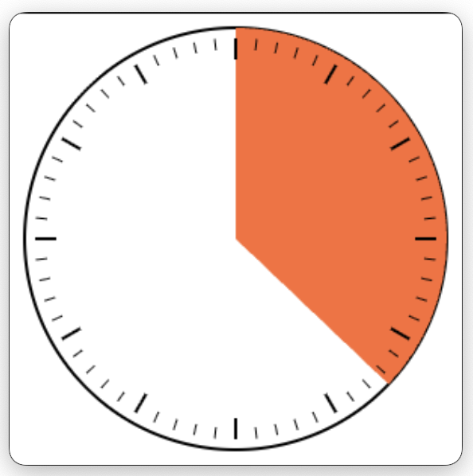

# TaskTimer

**[▶ Try it now](https://vre.github.io/tasktimer/TaskTimer.html)**

Analog countdown timer that runs entirely in your browser from single file. No ads, no servers, no tracking, no dependencies.

| Dark mode | Light mode | Digital (60+ min) | END mode | Picture-in-Picture |
|:-:|:-:|:-:|:-:|:-:|
|  |  |  |  |  |

## Features

- **Visual countdown** with intuitive pie chart display
  - **Up to 180 minutes** with multi-ring support
  - Start immediately with **fast presets** for 5, 10, 15... 90 min
  - **Three timer modes**: Counter-clockwise**, Clockwise, End time
  - **6 presets for pie color**
  - **Dark theme** and **Light theme**
- **Simple Alarm sound**: beeb beeb beeb with Web Audio (no audio files)
- **Fullscreen mode** and **Picture-in-Picture** mode (with supported browsers)
- **URL contains settings**: bookmark the timer configuration used

- **Keyboard shortcuts**: space for pause/resume, F for fullscreen, P for picture-in-picture, Esc for exit
- **Install as standalone web app**: PWA manifest included
- **Single HTML file**: copy the file where ever you need, no dependencies

## Usage

Open [TaskTimer.html](https://vre.github.io/tasktimer/TaskTimer.html) in any modern browser. That's it.
You can also copy it to your machine (Save As) and open from there.
Or when opening from website such as GitHub, you can also install as a PWA (Progressive Web App).

## Why?

Sometimes you just need a timer that looks good and stays out of your way.

## License

MIT
